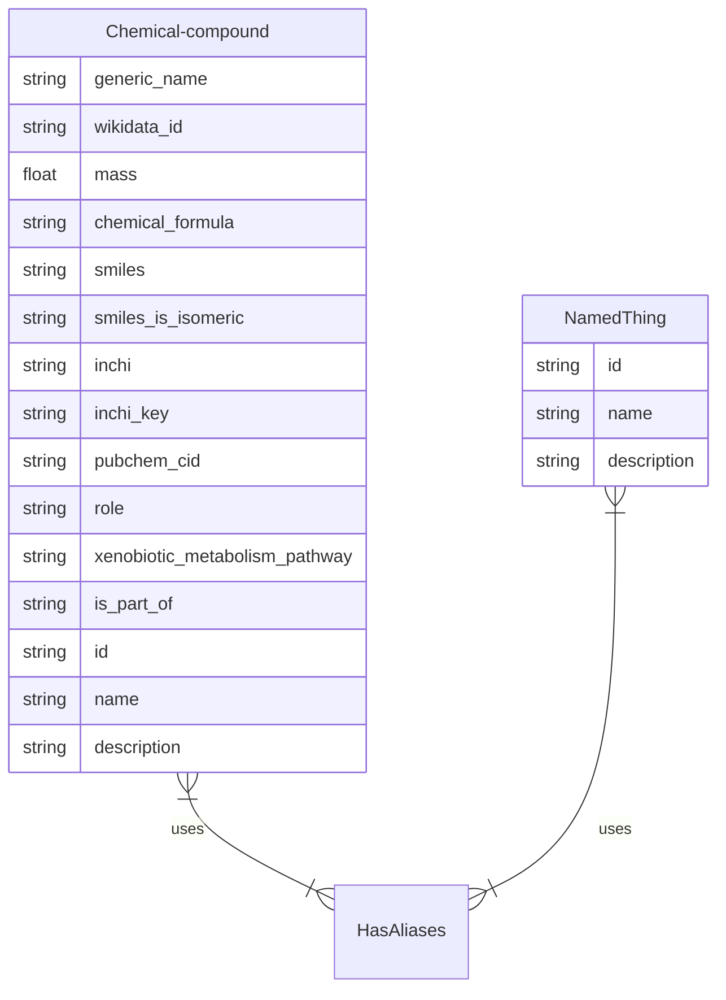

Create mermaid code in `mermaid.txt`
`gen-erdiagram --format mermaid classes.yml > mermaid.txt`


But also here needs adding the relations (last two lines in above code block).

Create yUML code in `classes.yuml`
`gen-yuml classes.yml > classes.yuml`
But at least here it needed still some fiddling to work.

```yuml
// {type:class}
// {direction:topDown}
// {generate:true}

[NamedThing|id:string;name:string;description:string]^-[Chemical-compound|generic_name:string;wikidata_id:string;mass:string;chemical_formula:string;smiles:string;smiles_is_isomeric:string;inchi:string;inchi_key:string;pubchem_cid:string;role:string;xenobiotic_metabolism_pathway:string;is_part_of:string;id(i):string;name(i):string;description(i):string]
[Chemical-compound]uses-.->[HasAliases]
[Chemical-compound]uses-.->[HasAliases]
```

Use to lint the yaml file.
`linkml-lint classes.yml` with/without `--validate` flag.


